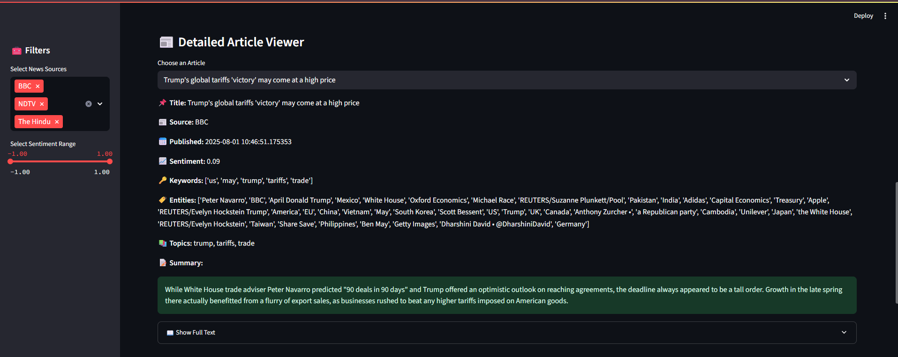
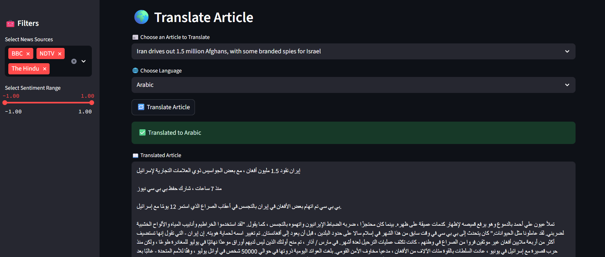
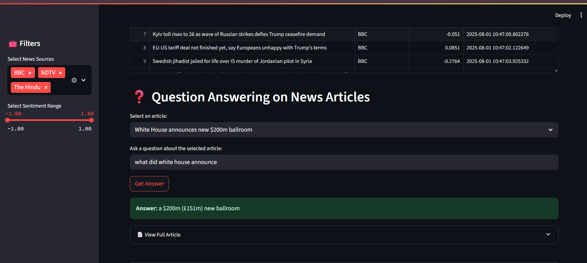

# 📰 News Analyzer with Web Scraping, Sentiment & Translation

A complete web application built using **Python**, **Streamlit**, and **NLP** techniques to scrape news articles, analyze them for sentiment, extract topics and keywords, Interactive Question and Answering about the news Article  and provide language translation — all in an interactive UI!

---

## 🎯 Key Features

### 1. 📥 Web Scraping (`scrapper.py`)
- Scrapes articles from multiple online sources.
- Extracts key metadata: **title**, **text**, **source**, **URL**, **published date**.
- Stores results in a CSV file `articles.csv`.

### 2. 📊 Article Enrichment & Analysis (`analyzer.py`)
- Reads scraped articles from `articles.csv`.
- Adds enriched columns:
  - ✅ Sentiment (Positive / Negative / Neutral)
  - 🔑 Extracted keywords
  - 🧠 Named Entities (like organizations, persons, dates)
  - 📚 Main Topics using unsupervised topic modeling
- Saves results in `enriched.csv`.

### 3. 📈 Interactive Data Visualizations
- Sentiment distribution pie chart
- Top keywords & topics bar charts
- Entity frequency count
- Source-wise article breakdown

### 4. 🌐 Language Translation (translator.py)
- Select an article title from dropdown
- Choose any target language (over 50+ supported)
- Click **"🔁 Translate Article"** to view full article translated
- Powered by [Deep Translator](https://pypi.org/project/deep-translator/)

### 5. 💡 Q&A Section(qa_helper.py) 
- Ask questions about the article content
- Returns answers using extractive QA (based on transformers or keyword matching)

---

## 🖼️ Screenshots

### 🔍 Article Analysis Page  

### 📈 Data Visualizations  

### 🌐 Translation Feature  

---
### ❓ Question Answering on News Articles

---

## 🎬 Demo Video

📥 [Download Demo Video](videos/demo.mp4)

---

